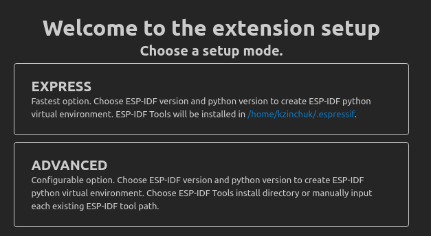
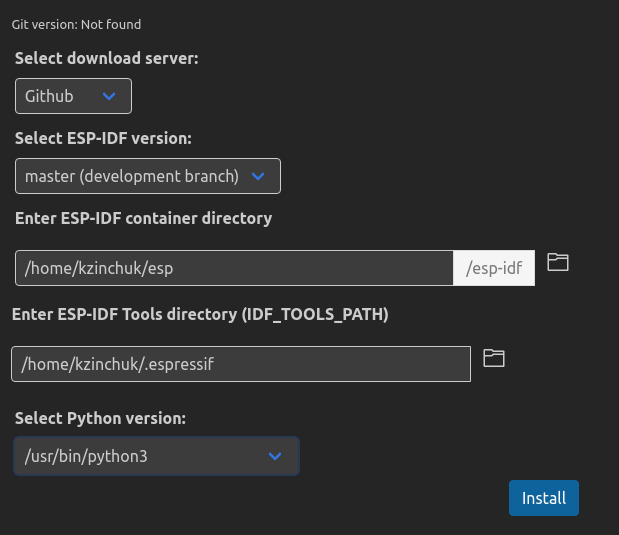

# AGENDA

This guide had been created for proper installation of all needed tools to start of developing the walkie-talkie example.

>note: Guide is provide all steps needed according to Ubuntu 20.04
---
## Walk through
- [vscode](#vscode)
- [esp-idf pluggin](#espressif-idf) to vscode
- [plugin interface](#plugin-interface-guide) guide
- [Arduino IDE](#arduino)
- [ESP32 in Arduino](#esp32-in-arduino)
- [Test sample](#test-sample)
- In case of any [trouble or more info](#usefull-links-and-info)

## Vscode
First things first and we start from vscode installation. To install latest stable version of **vscode** open your terminal and paste command bellow:
```cmd
sudo snap install --classic code
```
That's it. Now open vscode manually or through terminal via command:
```
code
``` 
Now we are ready to go to the next step.

---
## Espressif-idf
In general you can use esp-idf, which is full supported IDE for development with ESP. But for the first steps in ESP32 I prefer simple **Espressif-idf** plugin in **vscode**. 

To install it go to extencions in vscode manually or press hot-keys: **Ctrl+Shift+X**. Type in 
```
Espressif IDF
```
the extension icon should look like this:


Click install. Then you will notice new icon on a side bar:


Click on it and you will see menu:



Click on **Express**. Set installation properties as shown below and click install.



Wait till installation complete and go to the next step. 
> Hint

Replace **/home/kzinchuk/...** with any folder you want

---
## Plugin Interface-Guide
Now you can see new icons in the bottom-left angle.


there is the meaning of this icons:
-  is your current projet
-  is [device port](#device-port)
-  is configuration of Espressif-idf
-  is cleaning your CMakeCache for whole project
-  is build your project depending on CMakeLists.txt that you will write 
-  is send your project to ESP device through port that you can choose in port menu
-  is output info about current state of the ESP
-  is make build, flash and monitor.
-  show errors and warnings


### Device port
Execute 
```
ls /dev/tty*
```
before and after insertion of your ESP32 device in yout laptop/computer. You probably notice, that you have new **/dev/ttyUSB0** device. That is your port, through it you will flash you ESP32. 

To not bother yourself with configuring port everytime you plug and unplug your ESP32 and don't be bother with root-access problems, we can add current user to  **dialout** group, which provide root access from current user to this port. You can do this as below:
```
sudo usermod -a -G dialout $USER
```
You may need log out and log in to you system after execution for changes to be applied, in some cases, reboot. 

--- 
## Arduino
Another way to work with ESP32 is from Arduino IDE. To install Arduino, first of all you need to check that you Ubuntu package is up to date:
```
sudo apt-get update
sudo apt-get upgrade
```
Then create new folder for arduino files and download **tar** file of arduino downloader:
```
mkdir ~/arduino
cd ~/arduino/
wget https://downloads.arduino.cc/arduino-1.8.15-linux64.tar.xz
```
Unpack this **tar** file
```
tar -xvf ./arduino-1.8.15-linux64.tar.xz
```
Install Arduino using the installer script:
```
cd arduino-1.8.15/
sudo ./install.sh
```
After installation open arduino to check if it install properly.

---
## ESP32 in Arduino
Come to you arduino hardware folder and create new folder for ESP32:
```
cd ~/arduino/arduino-1.8.15/hardware
mkdir espressif
cd espressif
```
Clone ESP32 core to **espressif** folder and go to **esp32** folder
```git
git clone https://github.com/espressif/arduino-esp32.git esp32
cd esp32
```
Update submodules in cloned **esp32** folder:
```git
git submodule update --init --recursive
```
And run final python file:
```
cd tools
python get.py
```
After this open(restart if it was open) Arduino. 

Go to **Tools->Board->ESP32 Arduino->DOIT ESP32 DEVKIT V1**.

This path shown above may vary but final goal is to find **DOIT ESP32 DEVKIT V1**.

---
## Test sample
>Arduino sample

Open Arduino IDE, choose **DOIT ESP32 DEVKIT V1** and past code bellow:

```c
int LED = 2; // pin number on ESP32 board

void setup() {
pinMode (LED, OUTPUT); // set mode to pin in which it will work

}

void loop() {
digitalWrite(LED, HIGH); // send signal to led pin to switch it on
delay(1000); // delay between sending signals
digitalWrite(LED, LOW);// send signal to led pin switch it off
delay(1000);

}
```
If all went well you should see led blinking on your board.

>Espressif-idf

Before all further steps, you should do proper configuration for **esp-idf**.

You should come down to directory you chose(or from enywhere else, but be sure) via in [Espressif-idf](#espressif-idf) installation section and execute this commands below:
```cmd
# consider that you are in your installation directory
cd esp-idf 
./install.sh esp32
```
After install complete run next command:
```cmd
. ./export.sh
```
This will export all needed files for **idf.py**. Further commands will make **idf.py** visible for all system. 
```cmd
export IDF_PATH=~/esp/esp-idf
export PATH="$IDF_PATH/tools:$PATH"
```
Now we can create empty project in VS Code.
```cmd
idf.py create-project --path <folder> <project_name>
```
Open this project you create above, open **main directory** and find **<project_name>.c** file. Past this sample in it and try build(using [interfaces](#plugin-interface-guide) buttons)
```c++
#include <driver/gpio.h>
// Include FreeRTOS for delay
#include <freertos/FreeRTOS.h>
#include <freertos/task.h>
#define LED 2 // LED connected to GPIO2
int app_main() {
    // Configure pin
    gpio_config_t io_conf;
    io_conf.intr_type = GPIO_PIN_INTR_DISABLE;
    io_conf.mode = GPIO_MODE_OUTPUT;
    io_conf.pin_bit_mask = (1ULL << LED);
    io_conf.pull_down_en = 0;
    io_conf.pull_up_en = 0;
    gpio_config(&io_conf);
    // Main loop
    while(true) {
        gpio_set_level(LED, 0);
        vTaskDelay(500 / portTICK_RATE_MS);
        gpio_set_level(LED, 1);
        vTaskDelay(500 / portTICK_RATE_MS);
    }
}
```
It should build correctly and then try to flash it on your device. When hit **flash** icon you should choose **UART** method. In some cases it would not flash it automatically and you will see:
```
Connecting.....______.....
```
For those who faced this, press **BOOT** button on ESP32 board and hold for couple of seconds. Then it will flash and you will see LED blinkg every 0.5 seconds.  

---
## Usefull links and info
>General info about ESP32
- [get started](https://docs.espressif.com/projects/esp-idf/en/latest/esp32/get-started/)
- [build system](https://docs.espressif.com/projects/esp-idf/en/latest/esp32/api-guides/build-system.html)

> Conflict between Python2.x and Python 3.x
- [set python 3 as default](https://askubuntu.com/questions/761106/how-to-remove-python-2-in-16-04)

> Is that only C suuport in ESP32?
- [answer](https://www.esp32.com/viewtopic.php?t=13040)